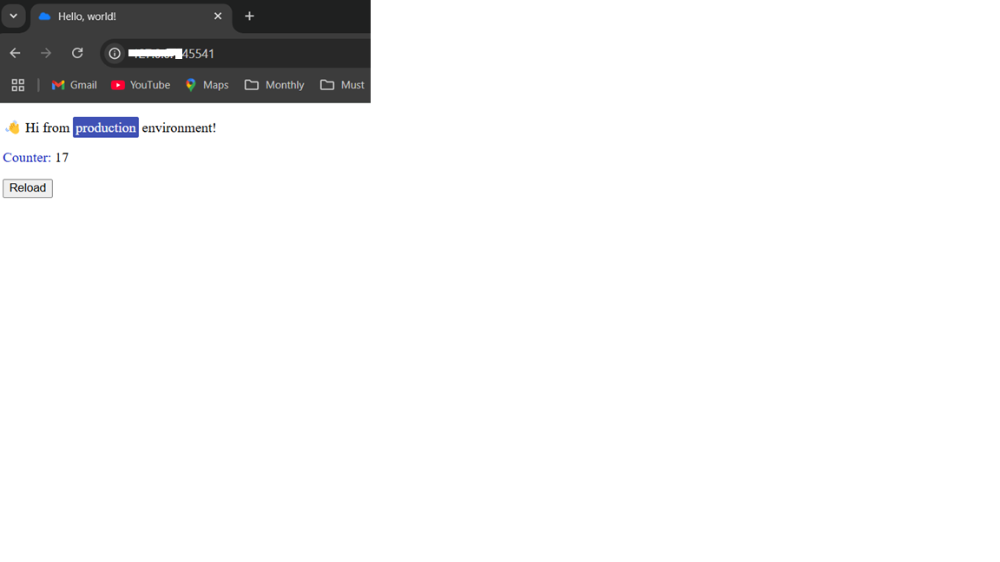
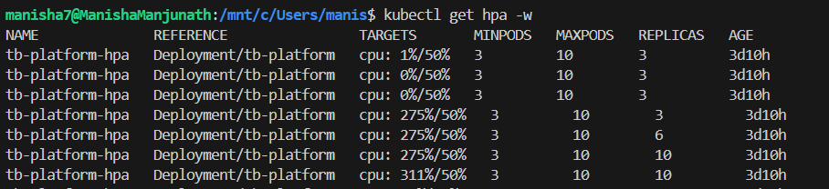
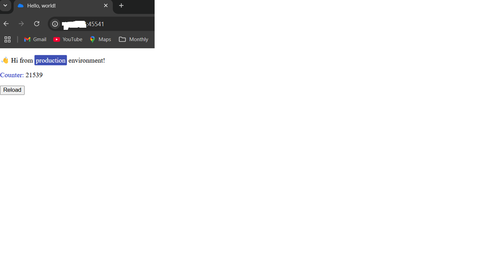

# Demo Application Kubernetes Deployment

This repository contains my solution for deploying a demo Python/Tornado application on Kubernetes. The goal was to create a production-ready, scalable deployment that meets specific requirements while following best practices.

## Challenge Requirements

The main requirements were to:
- Containerize the demo application
- Set up a local Kubernetes deployment (production-like)
- Maintain at least 3 replicas
- Implement CPU-based autoscaling
- Handle environment variables securely
- Focus on scalability and performance

## Solution Overview

### Application Stack
- Python/Tornado web application
- Redis for data storage
- Health checks for reliability

### Container Setup
I chose Docker with Python 3.9 slim as the base image to keep the container lightweight while maintaining good compatibility. The container runs as a non-root user for better security.

### Kubernetes Configuration
The deployment uses Kustomize for managing different environments (dev, qa, preprod, prod). This makes it easy to maintain environment-specific settings while keeping the base configuration DRY.

Key features:
- Base configuration with production defaults
- Environment overlays for specific customization
- Resource limits and requests
- Horizontal Pod Autoscaling
- Network policies for security

### High Availability
- Minimum 3 replicas in production
- Rolling updates for zero-downtime deployments
- Pod disruption budget to maintain availability
- Readiness/liveness probes for health checking

### Environment Variables
Sensitive data is handled through Kubernetes Secrets, with different configurations per environment. This keeps credentials secure while remaining easy to manage.

